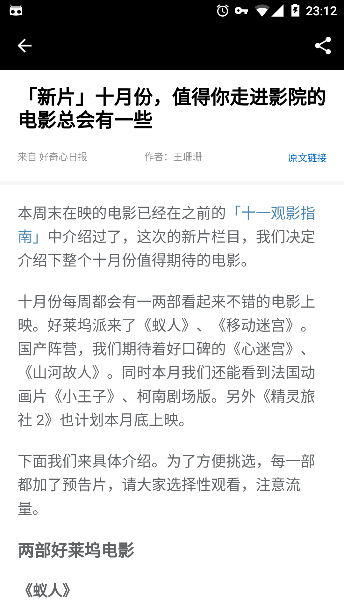

# DailyReactNative
Simple ZhiHu Daily App implemented using React Native.

##Screenshots

##Build
* react native: 0.41.2
* react-native-cli: 1.0.0

##Technology Used
* Flex Style
* DrawerLayoutAndroid
* Create Native module
* Native UI Components
* Text/Image/ListView
* TouchableNativeFeedback
* ToolbarAndroid/Navigator
* StyleSheet/ToastAndroid/BackAndroid
* AsyncStorage
* Animations

##Thanks
[ZhihuDaily-React-Native](https://github.com/race604/ZhiHuDaily-React-Native/)

##LICENSE
* MIT License
